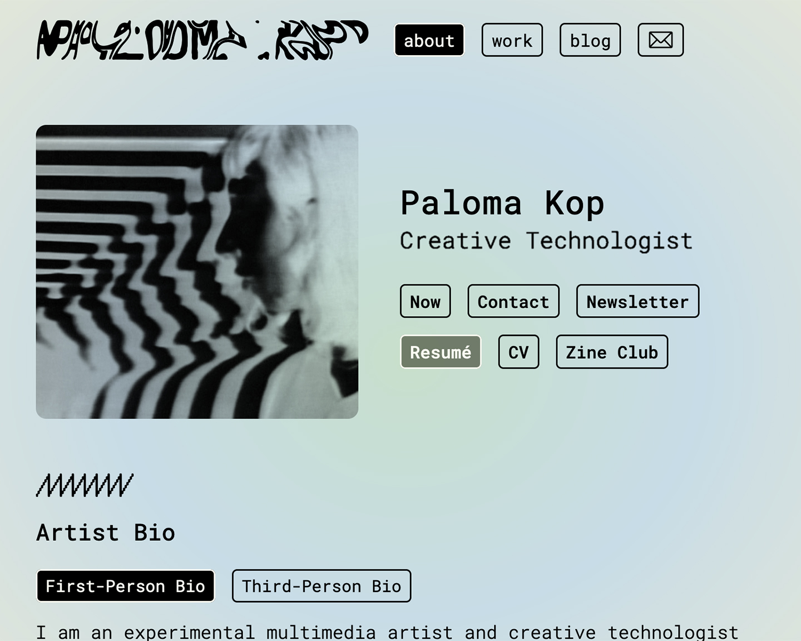
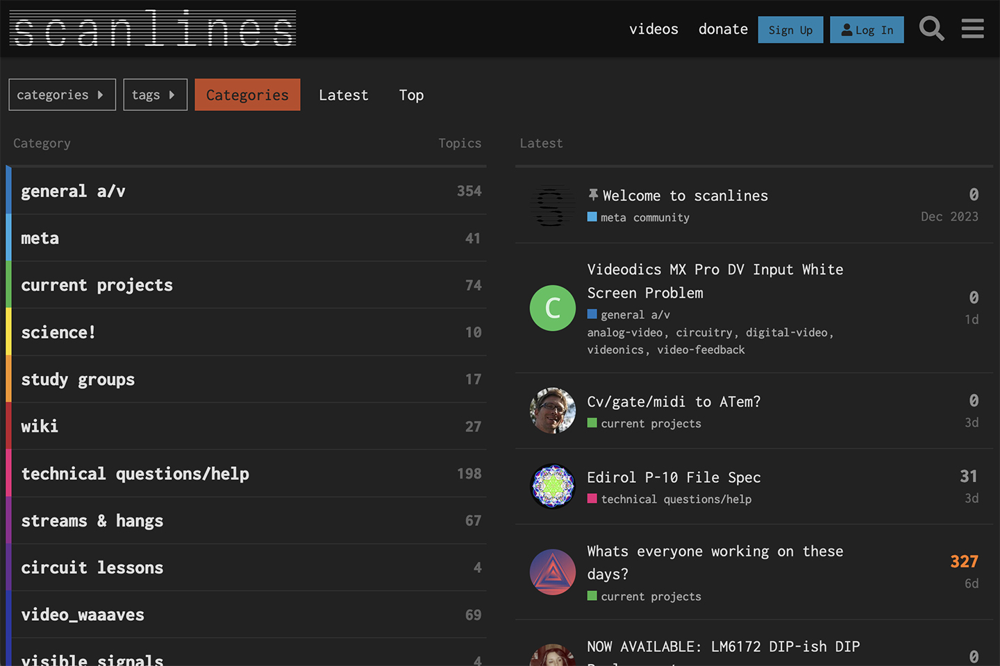
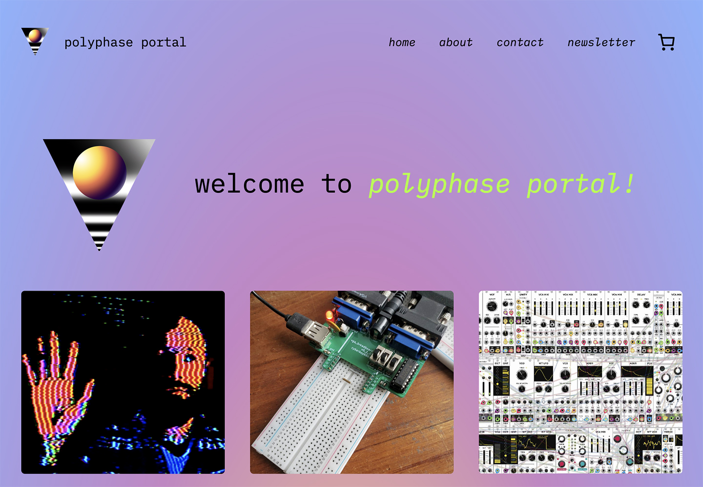
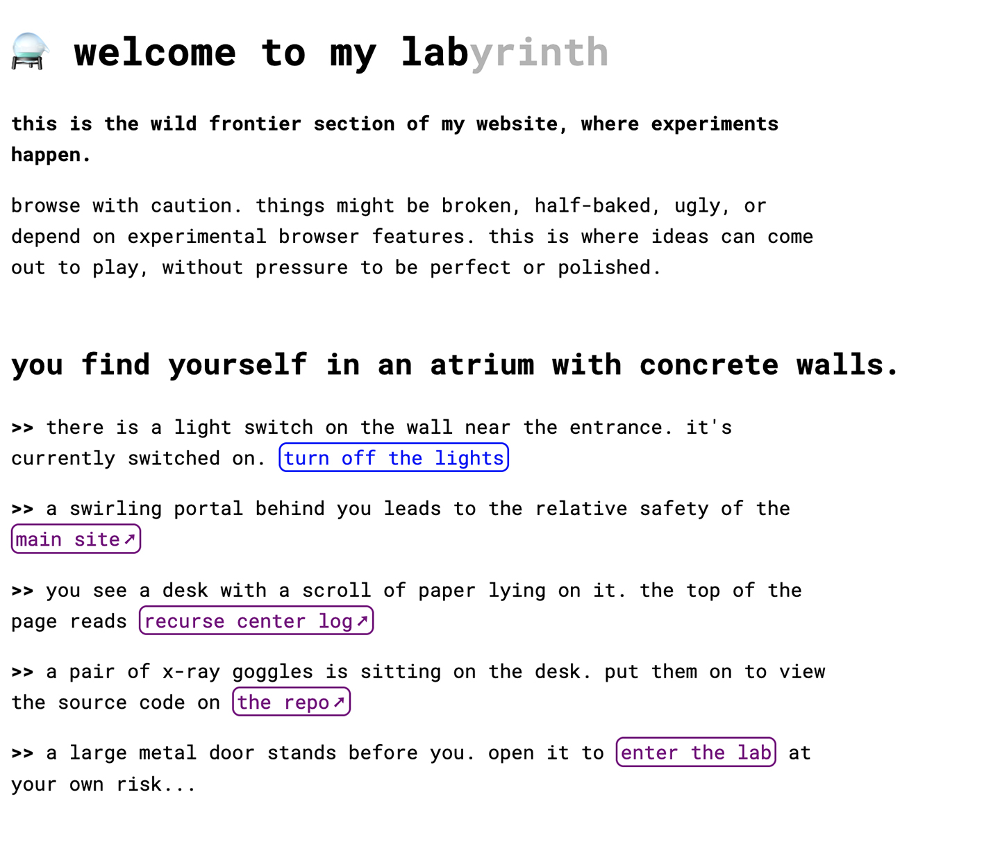
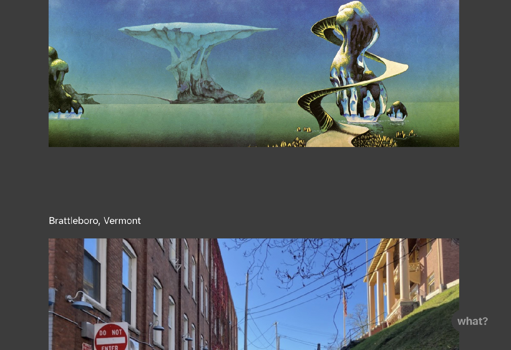

# Technical Projects

*A list of my technical projects, and the tools used to create them*

## Personal Website

My homepage on the web, a space to display art projects and blog posts

[Code Repository](https://github.com/palomakop/palomakop.tv-11ty) | [Website Link](https://palomakop.tv)

**Tools used:**
- [Eleventy](https://11ty.dev) static site generator, which is built on [Node.js](https://nodejs.org/en)
- Automatic build & deploy via [Netlify](https://www.netlify.com/) triggered by each new commit to the Github repo

**Highlights:**
- Custom build configs written in JavaScript for shortcodes and other build-time goodies ([code](https://github.com/palomakop/palomakop.tv-11ty/blob/main/.eleventy.js))
- Custom video embeds via the [Vimeo Developer API](https://developer.vimeo.com/api/guides/start) allow me to get thumbnail images and provide a JavaScript-free fallback via the html5 `video` tag
- A custom music player written in JavaScript for embedding music albums ([demo](https://palomakop.tv/work/sleepwalks-tapes/), [code](https://github.com/palomakop/palomakop.tv-11ty/blob/main/src/js/musicplayer.js))
- A custom lightbox viewer in JavaScript for image galleries based on [Simple Lightbox](https://github.com/dbrekalo/simpleLightbox) ([demo - scroll down and click any image to open lightbox](https://palomakop.tv/work/synthetic-forest/))
- Custom templates written in [Liquid](https://shopify.github.io/liquid/)
- Font subsetting with [Python FontTools](https://github.com/fonttools/fonttools) for improved site load performance
- All site code was written from scratch (no starter templates were used)

## Community Infrastructure

I set up and administrate online services for community organizations, running on virtual private servers

### Scanlines.xyz

An online community for people interested in DIY analog video circuits and art

[Website Link](https://scanlines.xyz)

**Tools used:**
- The web forum runs on [Discourse](https://www.discourse.org/), an open-source forum software with a Rails back-end and an Ember.js front-end
- We also administrate a [Peertube instance](https://joinpeertube.org/) to provide video hosting to the community

**Highlights:**
- I built a custom [Discourse theme component](https://github.com/cyberboy666/scanlines-technical-details/blob/master/embedded_chat_window_for_discourse.md) for a collapsible embedded chat widget. This became a proof-of-concept for an official plugin by Communiteq, a managed Discourse hosting service
- I also built a custom Discourse theme component for adding an embedded livestream video to the forum during live online events. It was initially a customized player based on [video.js](https://videojs.com/), but now uses Peertube. This was used in conjunction with the custom chat widget to provide a Twitch-like experience
- Previously, we also ran a streaming server that used [an RTMP module for Nginx](https://github.com/sergey-dryabzhinsky/nginx-rtmp-module) to serve an HLS livestream video; this has been deprecated as Peertube has built-in video streaming

### Polyphase Portal

A cooperatively-run virtual school for online classes and workshops

[Website Link](https://polyphaseportal.xyz)

**Tools used:**
- The main website is a [Wordpress](https://www.discourse.org/) instance, which I set up with Woocommerce and Stripe integration for ticket sales
- We run a [BigBlueButton instance](https://joinpeertube.org/) instance for video calls (it's an open-source Zoom alternative that's tailored to online teaching)
- We also run a [Matrix chat server]() to provide a space for connection outside of class time
- Our SSO server runs on [Keycloak]()

## Personal Projects

### The Lab

A minimal, text-adventure themed website to showcase small web-based projects and experiments

[Code Repository](https://github.com/palomakop/lab) | [Website Link](https://lab.palomakop.tv)

**Tools used:**
- The static website is built with [Eleventy](https://11ty.dev) and deployed via [Netlify](https://www.netlify.com/), similarly to my main personal website
- Embedded interactive sketches created with:
  - [GLSL (fragment shaders)](https://www.khronos.org/opengl/wiki/Fragment_Shader)
  - [p5.js](https://p5js.org)
  - [Three.js](https://threejs.org/)
- The Three.js sketch features a 3D model created in [Houdini](https://www.sidefx.com/products/houdini/)

**Highlights:**
- A dark/light mode toggle that initializes based on the device color scheme (system-wide dark/light mode), then saves the toggled state in local storage for future visits

### txxt.club

An image and text microblog that my friends and I can post to via SMS

[Code Repository](https://github.com/palomakop/txxt-bridge)

**Tools used:**
- [Twilio](https://twilio.com) serverless function running [Node.js](https://nodejs.org/en)
  - Twilio provides a phone number to receive incoming SMS, and an API for launching a function when a new message is received and sending outgoing SMS
- [WriteFreely](https://writefreely.org/), an open-source blog platform with an API
  - The WriteFreely instance, hosted on my server, provides the front-end blog site, as well as an RSS feed and ActivityPub stream
- [ImgBB](https://api.imgbb.com/), an image hosting service with an API

**Highlights:**
- I wrote a bridge that takes incoming SMS text and image messages and posts them to the WriteFreely blog
- It also replies via SMS with the blog URL once the new post is created
- There is no authentication, but only people who know the phone number can post, so it is shared only by word of mouth
- Can accept messages with multiple attachments, and will include all image attachments in the blog post
- Text-only posts are also supported
- When the Twilio phone number is called, it plays an audio message with instructions for posting to the blog

## Work Projects

### Mediary

A web app for video producers and editors at Paramount to launch and manage file-based workflow automations

**Tools used:**
- JavaScript front-end
- RESTful API microservices built with [Flask](https://flask.palletsprojects.com/en/stable/)
- Custom integrations with external vendor APIs and enterprise software products
  - [IBM Aspera Orchestrator](https://www.ibm.com/community/101/ibm-aspera-101/ibm-aspera-orchestrator/)
  - [AWS Elemental MediaConvert](https://aws.amazon.com/mediaconvert/)
  - [Rev Transcription and Caption API](https://www.rev.com/api)
  - [SyncWords API](https://www.syncwords.com/)
  - [TeleStream Vantage](https://www.telestream.com/vantage/) and [ContentAgent](https://www.telestream.net/ContentAgent/overview.htm)

**Highlights:**
- I built a custom Flask API that allowed Mediary users to seamlessly interchangeably order captions from multiple vendor options
  - Our captioning vendors each had their own uniquie APIs and configuration options. The universal caption API I built allowed a caption order to be placed to any of these vendors using a normalized payload
- I built an integration with AWS Elemental MediaConvert that allowed Mediary users to launch jobs to AWS's cloud-based media encoding service
  - Previously, all of our media encoding was done with on-premises hardware; this integration helped transiton the department's infrastructure dependencies to the cloud
- I developed a unified template for all workflows to follow, improving consistency and maintainability
- I also created detailed documentation for all the projects listed above
- My team oversaw the transition of the Mediary app and its users to fully remote, cloud-based workflows, allowing them to seamlessly continue their work at the start of the pandemic
